# Task 0 学习笔记（按操作步骤）

> 状态：AI 起草（依据 2026-09-15 凌晨实测记录）→ **本人已精校**（2026-09-15）。
> 🖊️ 标记段已全部替换为本人体会；事实句经 AI 复核（Step 3 表述勘误一处）。
> 分层阅读：命令层看 [Task0操作手册](Task0操作手册.md) ｜ 坑位层看 [../research/Task0坑位全盘查.md](../research/Task0坑位全盘查.md) ｜ 本文 = 叙事层。
> 证据（txt 正典 + AI 渲染副本）存 [learn/pre/evidence/](../../evidence/)；本人截图属过程影像，存 [notes/assets/](../assets/)——同名 `20260915_stepN_slug`。每个 Step 关键图内嵌，其余以链接附在本步末尾。

---

## Step 0 · fork + clone ✅

在 GitHub 上 fork 上游课程仓，克隆到本地空目录，验证 remote 指向与提交历史。

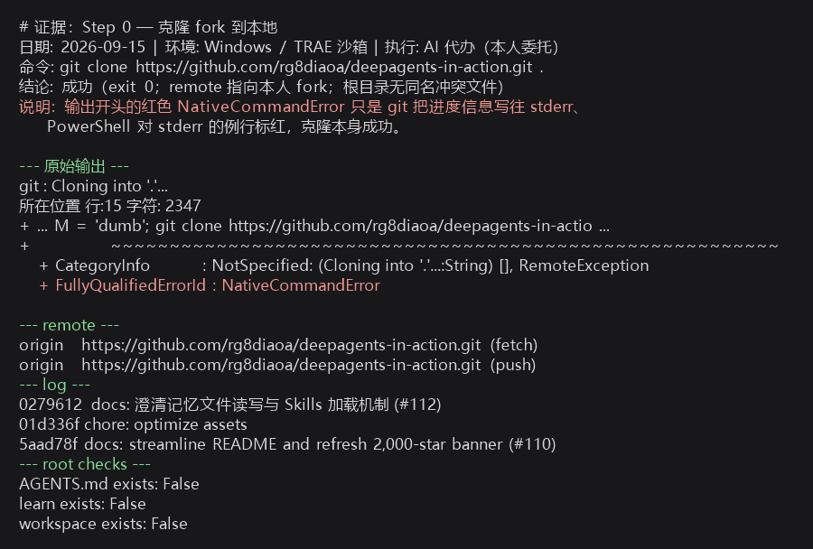

- 认知点（D3）：git 进度走 stderr，PowerShell 例行标红——**判断成败看 exit code，不看颜色**。
- 其余证据：[txt 原文](../../evidence/20260915_step0_clone.txt)

🖊️ 精校：frok上游可以更好同步上游仓库，且更好给上游提pr。

## Step 1–2 · learn/ 骨架 + AGENTS.md ✅

建 `learn/` 学习容器（notes 双轨 / evidence / infra），起草《AGENTS.md 人机协作规则》并本人审定生效——**上游文件零修改**是贯穿全程的铁律。

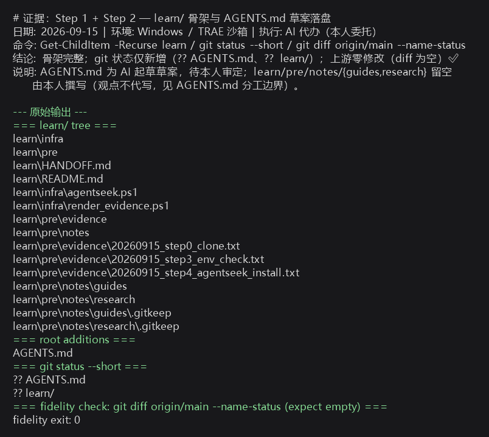

- 要点：`git diff origin/main --name-status` 输出为空 = 保真达标。
- 其余证据：[txt 原文](../../evidence/20260915_step1-2_learn_skeleton.txt)

🖊️ 精校：learn存放所有学习者有关的适配层、实验证据、测试、心得、排坑及其它有关的资料，保持课程主仓纯净，更好追溯（净室效应）；AGENTS.md可以gen'fAgent辅助学习（定人机协作规则，哪些可a代办，那些必须本人做，兼顾效率与效果）

## Step 3 · 环境探测 ✅

六项探测，五项达标：git 2.53 / Python 3.12.10 / Node 24 / npm 11 / uv 0.12.13；唯一异常是 `py` 启动器损坏（坑 A1，指向已删除的 3.14 残留路径）→ 全程改用 `python`。

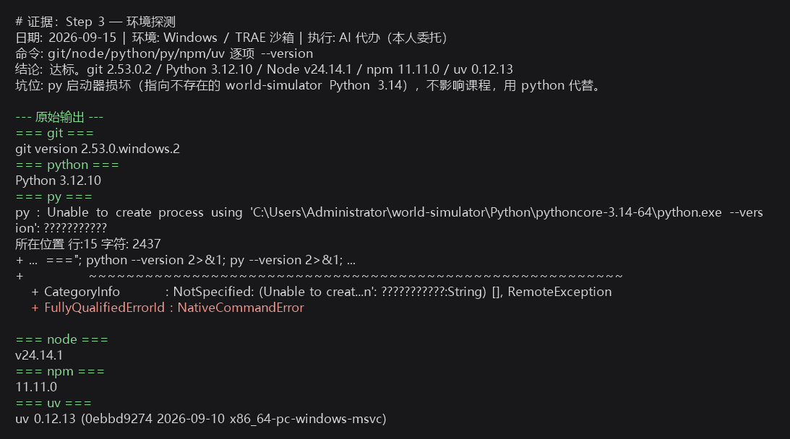

- 其余证据：[txt 原文](../../evidence/20260915_step3_env_check.txt)

🖊️ 精校：使用正确的环境运行，以免后续yun'xing遇到环境错误和版本不匹配的问题。

## Step 4 · 安装 AgentSeek CLI ✅（最曲折的一步）

`uv tool install --upgrade agentseek` 安装成功（0.1.4），但 exe 启动即崩（0xC0000135）。用**对照实验**定位：复制 uv.exe 能跑（排除沙箱拦新 exe）→ venv python 正常 → 锁定 trampoline × 沙箱组合；**本人终端验证完全正常** → 坑仅限沙箱内。

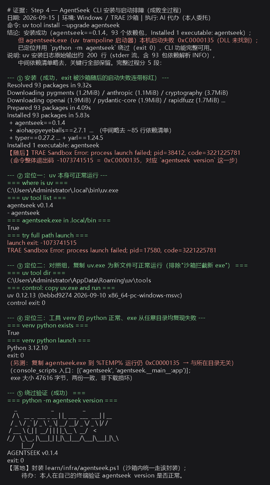

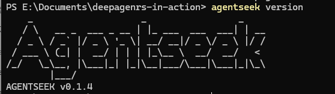

- 坑位：A2（trampoline）、B1（`agentseek-cli` 是旧包名，以 README 的 `agentseek` 为准）
- 处置：沙箱内统一走 [learn/infra/agentseek.ps1](../../../infra/agentseek.ps1) 封装
- 其余证据：[txt 排障记录](../../evidence/20260915_step4_agentseek_install.txt)｜[本人终端 txt](../../evidence/20260915_step4b_agentseek_own_terminal.txt)｜[PNG](../../evidence/20260915_step4b_agentseek_own_terminal.png)

🖊️ 精校：因为现在使用Agent辅助学习，Agent沙箱和本机真实环境有隔离，略有差异，更好区分Agent沙箱与真实环境执行命令时的不同，以免混淆。

## Step 5 · 创建模板项目 ✅

`mkdir workspace` 隔离实验区 → `agentseek create deepagents/default --checkout main --no-input` 一键生成 `my_deepagent`。

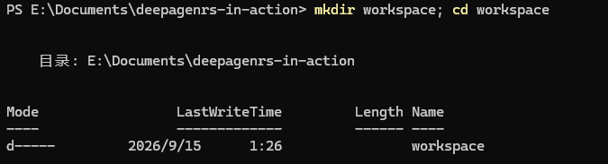

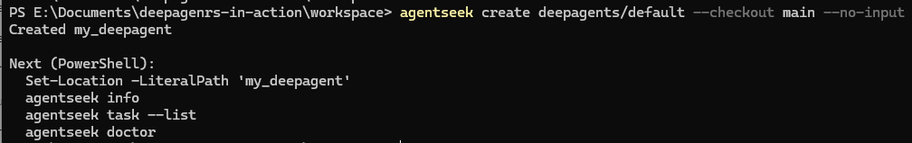

- 要点：Task 0 / ch01 / ch02 都用 `default` 模板；`--no-input` 跳过交互问卷。
- 其余证据：[create 转录 txt](../../evidence/20260915_step5_create_default.txt)（转录自本人截图，下同）

🖊️ 精校：放workspace的好处就是工作空间固定，更便于管理和区分，就算是模板项目搞坏了，也只影响workspace。

## Step 6 · 配置 .env ✅

`Copy-Item .env.example .env`，填 `BUB_MODEL`（openai:硅基流动模型）、`BUB_API_KEY`、`BUB_API_BASE=https://api.siliconflow.cn/v1`。

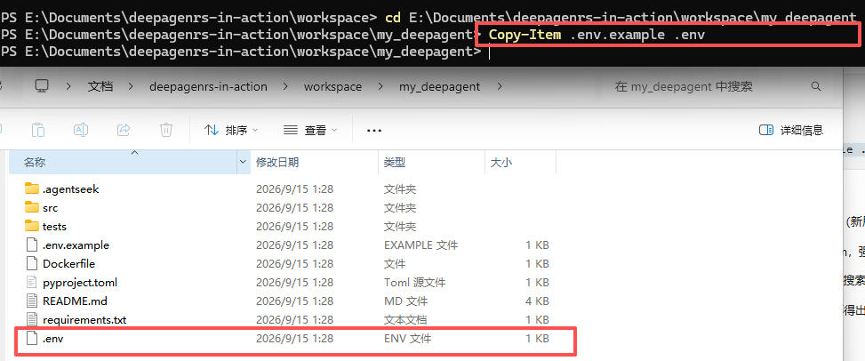

- 坑位：B2（课程 README 说的 `MODEL_NAME` 本模板不存在，以 `.env.example` 为准）、C4（`BUB_API_BASE` 是 doctor 不查的可选项，漏配会 401）
- 铁律：key 只进 `.env`，不进聊天/截图/提交。
- 其余证据：[env_copy 转录 txt](../../evidence/20260915_step6_env_copy.txt)

🖊️ 精校：`对于初学者来说.env可能是必须要理解的概念，这是api信息安全保障中的重要环节，也便于统一管理；同时配置.gitignore排除规则以免push泄密（.*）。`‌

## Step 7 · 安装依赖 ✅（npm 是假动作）

`uv sync` 一次通过（107 包，含 `deepagents==0.7.14`——版本线佐证）；`npm install --prefix frontend` 报 ENOENT——**default 模板根本没有前端**（坑 B3），npm 步骤作废。

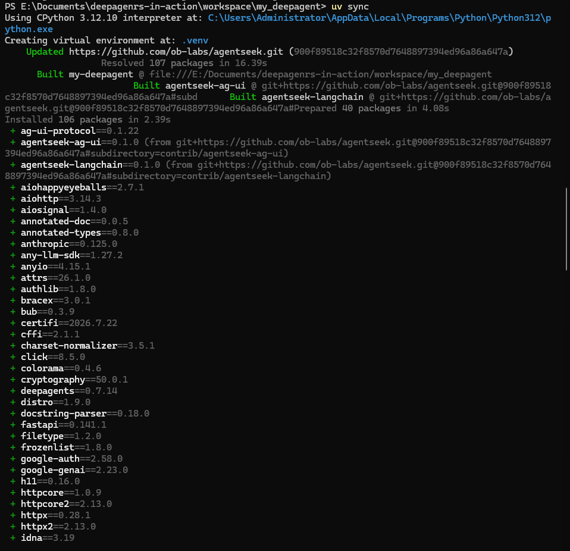

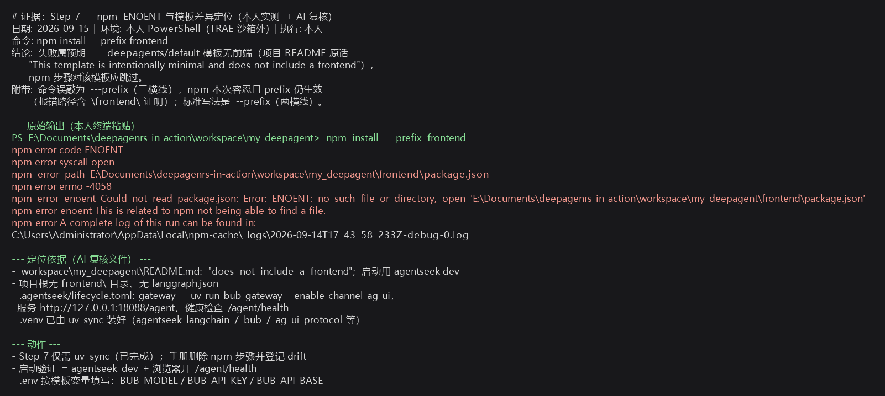

- 附带笔误（C1）：`---prefix` 三横线，npm 容忍了但标准是两横线——容错不是正确性。
- 其余证据：[ENOENT 排查 txt](../../evidence/20260915_step7_npm_enoent.txt)｜[uv sync 转录 txt](../../evidence/20260915_step7_uv_sync.txt)

🖊️ 精校：按课程里面的文档执行命令报错，原因竟然是子目录文档没有随项目工具更新而更新，课程作者需要一款能同步更新文档的工具（我做过（暂未开源），效果虽然不完美但是也能有点作用）。

## Step 8 · 体检与启动 ✅

`agentseek info`（项目摘要，当时 BUB_API_KEY 还显示 missing）→ `task --list`（只有 sync 一个任务，正常）→ `doctor` 精准拦截空 key（坑 C3）→ 填 key 后全绿 → `dev` 拉起 **Bub AG-UI 网关（:18088）**。

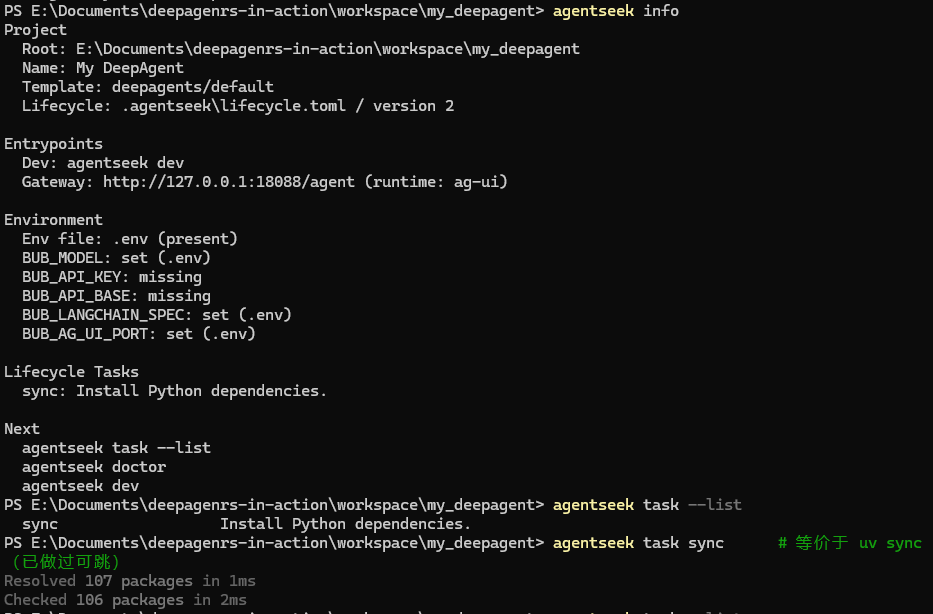

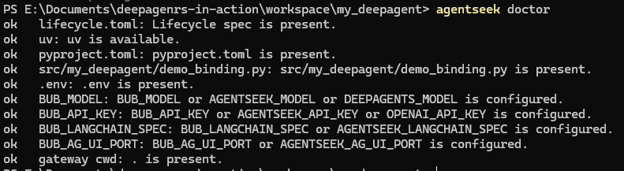

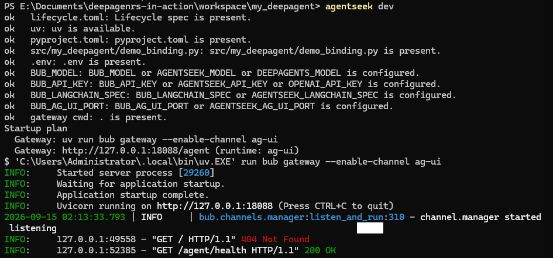

- 第三张图同框了两个坑：`GET / 404`（C2，路径前缀）与 `GET /agent/health 200`（正确路径）。
- 其余证据（转录 txt）：[info/task](../../evidence/20260915_step8_info_tasklist.txt)｜[doctor fail](../../evidence/20260915_step8_doctor_fail_key.txt)｜[dev 404/200](../../evidence/20260915_step8_dev_up_health200.txt)

🖊️ 精校：doctor全ok，dangentseek dev 居然报404，最后检查health联通正常（20），部18088下的“/”路径本身不同且没UI（纯后端），非配置问题。

## Step 9 · 健康验证 ✅（Task 0 核心验证点）

浏览器开 `http://127.0.0.1:18088/agent/health` → 200 JSON；AI 从本机独立探测同样 200 → **双确认**。

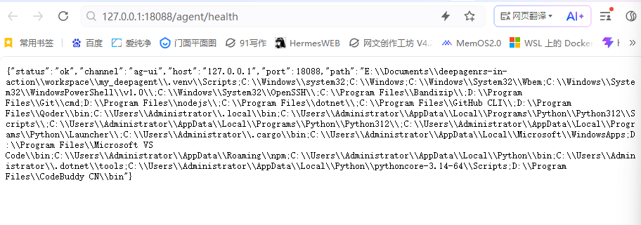

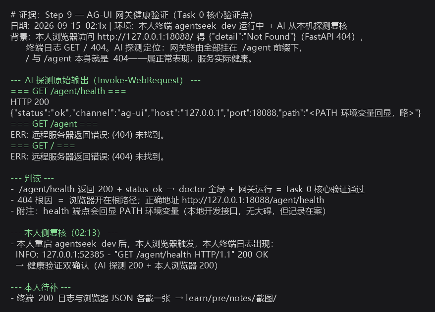

- 坑位：C2（根路径 404 是正常表现，别慌）。
- 其余证据：[txt 探测记录](../../evidence/20260915_step9_gateway_health.txt)｜[browser 转录 txt](../../evidence/20260915_step9_health_browser.txt)

🖊️ 精校：跟上一步de结果一致，因为不放心纯200提示，直接看浏览器并用Agent复核，确认服务zheng'chang。

## Step 10 · 安装开发技能 ✅

`agentseek skills` 在 0.1.4 已被移除（坑 B4）→ 改用课程 README 的 `npx skills add ob-labs/agentseek --skill <名称>`；交互界面直接 Enter 用 Universal 默认（坑 C5）。

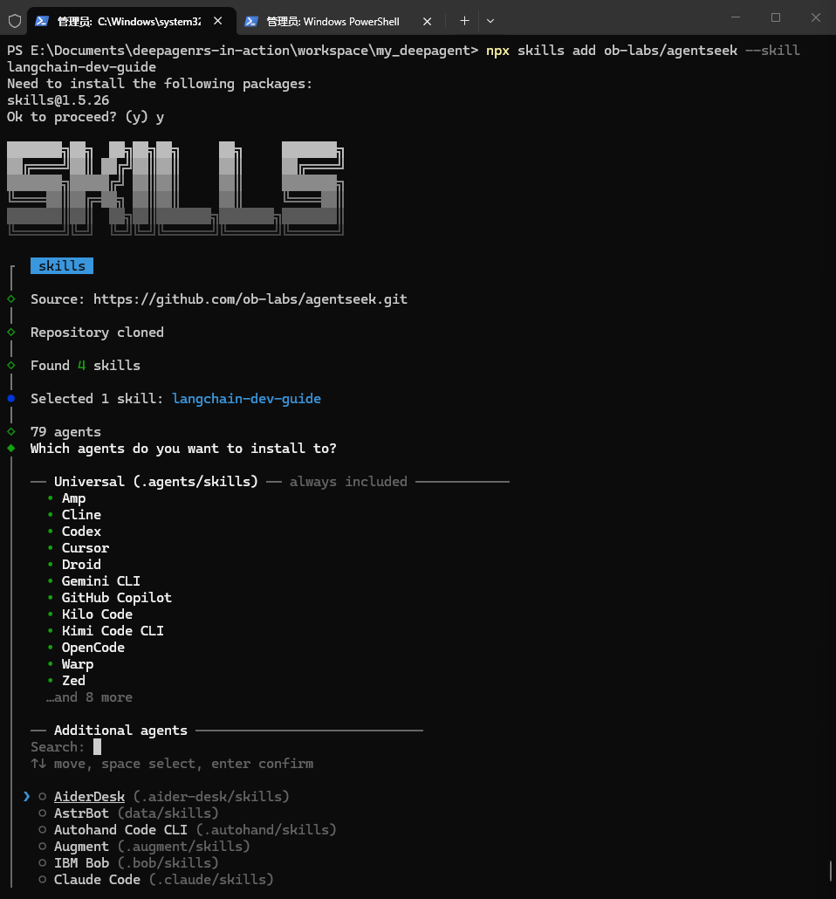

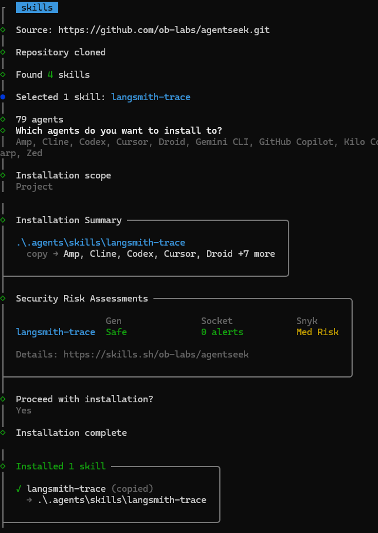

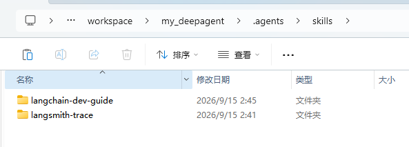

- 细节：skills CLI 会给出**安全评分**——langchain-dev-guide 为 Low Risk，langsmith-trace 为 **Snyk Med Risk**（装第三方技能包时值得看一眼）。
- 其余证据：[langchain-dev-guide 安装](../assets/20260915_step10_langchain_guide_installed.png)｜[drift 排查 txt](../../evidence/20260915_step10_skills_command_drift.txt)｜[PNG](../../evidence/20260915_step10_skills_command_drift.png)｜[安装流程转录 txt](../../evidence/20260915_step10_skills_install.txt)

🖊️ 精校：其实我本身不是特别关注这个安全ping'fen，因为是课程推荐的skill，但是我让Agent检查复核截图时发现有这个，关注了一下，以后自己使用时会核对一下，避开危险skill。

## 收尾 · 归档与入库 ✅

证据分层落位（AGENTS.md §6）：evidence/ 26 个（txt 正典 17——含 8 份转录——+ AI 渲染副本 9）、过程影像 notes/assets/ 13 张；学习笔记 + 操作手册 + 盘查三件套成稿；`workspace/` 源码入库（`d4433c4`），`.env`/`.venv`/`egg-info` 由 `.gitignore` 排除（坑 D1，提交前 check-ignore + 暂存区 grep 三重校验）。

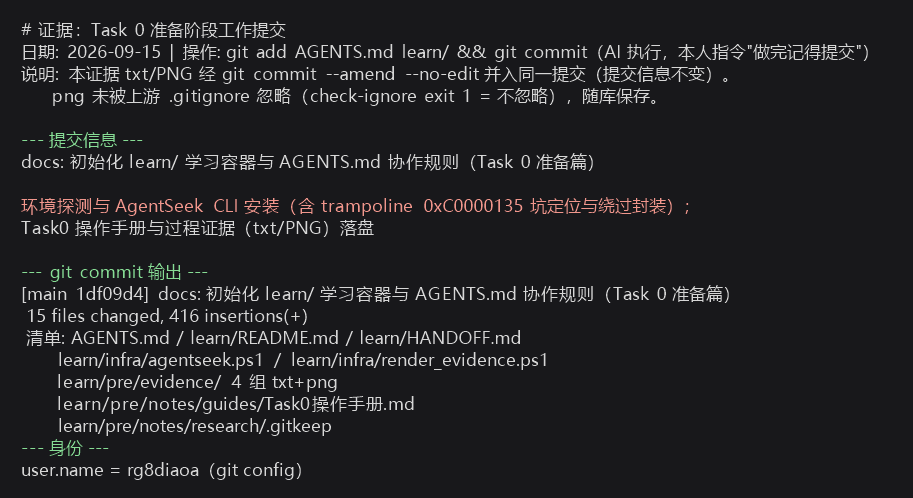

- 其余证据：[commit txt](../../evidence/20260915_commit.txt)

🖊️ 精校：workspace该进git，配合learn更能记录学习进度和情况，但是workspace下的环境相关不该进git（没必要也太占空间），可重建的与隐私信息无需进git。

## 复盘三问

已作答于 [../research/Task0坑位全盘查.md](../research/Task0坑位全盘查.md) 的「人工复盘」一节（2026-09-15 本人手写）：

1. B1–B4 的共同根因与权威源排序
2. 对照实验方法的迁移场景
3. C2/C3/C4 三原则的重述与迁移举例

## 交付物清单

| 层 | 文件 |
|---|---|
| 叙事层（本文） | `notes/guides/Task0学习笔记.md` |
| 命令层 | `notes/guides/Task0操作手册.md` |
| 坑位层 | `notes/research/Task0坑位全盘查.md` |
| 证据层 + 影像层 | `evidence/` 26 个（txt 正典 + AI 渲染副本）＋ `notes/assets/` 13 张（本人截图） |
| 实验项目 | `workspace/my_deepagent/`（源码入库） |
| 协作规则 | 根目录 `AGENTS.md` |
